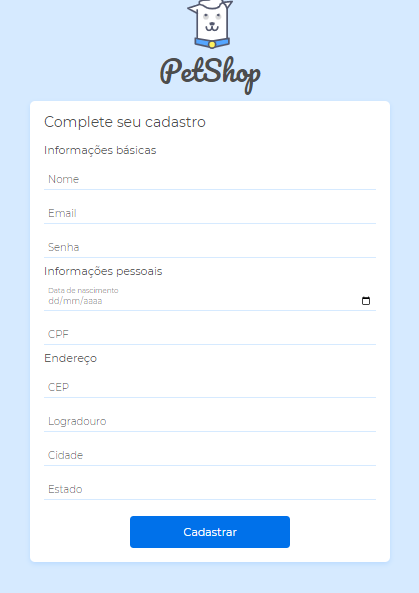

# Validação  de Formulario

Projeto simulando uma página de PetShop, com dois formulários. Um de cadastro de usuário e outro de cadastro de produtos.

## Motivação

Projeto com fins de estudo, aprendizagem e prática na validação de formularios com JavaScript e HTML e consumo de API de terceiros.

## Desenvolvimento

Para as validações foram utilizados as ferramentas do próprio HTML e JavaScript para validações customizadas.

Preenchimento do campo de endereço automaticamente com as requisições da API ViaCEP.

Aplicando no formulário de produtos uma máscara monetária no campo de preço.

## Tecnologias Utilizadas

- JavaScript
- HTML
- CSS
- Visual Studio Code

## Autor

- Douglas Andrade dos Santos

